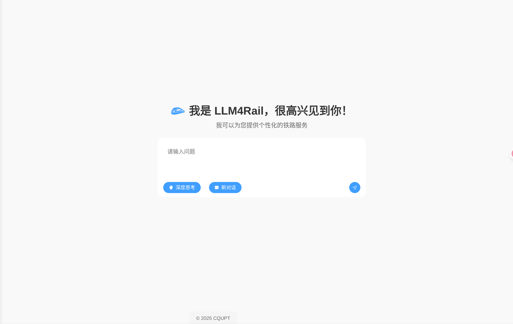

# LLM4Rail

LLM4Rail is an LLM-based railway platform using an iterative QTAO framework to combine verbal reasoning with actions like ticket inquiries and on-board food recommendations.

<!-- Illustration of LLM4Rail -->


# Requirements

- Python == 3.12
- openai == 1.97.0
- numpy == 1.26.4
- pandas  == 2.2.3
- levenshtein == 0.27.1
- scikit-learn == 1.6.1
- tqdm == 4.67.1
- transformers == 4.49.0

# Evaluation

## 1. Set Working Directory
Set the working directory to the project root.
```bash
cd <your project path>
```

## 2. Set Environment Variable
Set PYTHONPATH environment variable to the project's root directory.
```bash
export PYTHONPATH=<your project path>
```

## 3. Generate Test Queries
Run the script `evaluation/<task>/query_generator.py`.
```bash
python evaluation/<task>/query_generator.py
```
`<task>`: `weather` or `ticket` <br>
If you want to evaluate recommendation module, skip this step.

## 4. Evaluate Weather/Ticket Inquiry Module
Run the script `evaluation/<task>/evaluate.py`.
```bash
python evaluation/<task>/evaluate.py \
--model <model> \
--userFile dataset/user.csv \
--config evaluation/<task>/config.json \
--saveDir evaluation/<task>/save/ \
--GPTKey <your GPT key> \
-QwenKey <your Qwen key> \
-amapKey <your amap Key>
```
`<model>`: `qwen-3` or `gpt-4o` <br>

## 5. Evaluate Food & Drink Recommendation Module
Run the script `evaluation/meal/evaluate.py`.
```bash
python evaluation/meal/evaluate.py \
--model <model> \
--rec_model <rec_model> \
--topk <k> \
--config evaluation/meal/config.json \
--saveDir evaluation/meal/save/ \
--GPTKey <your GPT key> \
-QwenKey <your Qwen key> \
```
`<model>`: `qwen-3` or `gpt-4o` <br>
`<rec_model>`: `zero-shot` or `feature-augmented` <br>

## 6. Analysis The Results
Run the script `evaluation/<task>/analysis/analysis.py`. <br>
```bash
python evaluation/<task>/analysis/analysis.py --saveDir evaluation/<task>/save [--rec_model <rec_model>]
```
`<task>`: `weather`, `ticket` or `meal` <br>
`<rec_model>`: `zero-shot` or `feature-augmented` (only needed when `<task>`=`meal`) <br>
